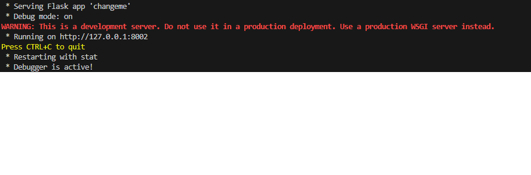

# Flask Framework - How to Change Port in Flask app

So, you know how when you make a website using Flask, it usually shows up on a specific web address, like `http://127.0.0.1:5000/`? Well, that's because Flask likes to use port 5000 by default.

But sometimes, that port is already being used by something else, so we need to change it. To do that, we just have to tell Flask to use a different port when we run our website.

Here's a little code snippet that shows how we can do that:

```python
if __name__ == '__main__':
    app.run(debug=True, port=port_number)
```




### REMEMBER

If you're experiencing issues where the Flask application doesn't seem to change the port, a few things could be happening:

1. **Port Already in Use:** Another application might already be using port 8002, causing Flask to fail to bind to that port. Try a different port number, like 8002 or 5000, to see if the issue persists.

2. **Firewall or Permissions:** Sometimes, firewall settings or system permissions might prevent applications from binding to certain ports. Ensure that your firewall settings or system permissions allow the application to use the specified port.

3. **Caching or Persistence:** If you're running this code in an environment that caches or persists settings, it's possible that the previous configuration is being reused. Restarting the environment or clearing cache might help.

4. **Environment Variables:** Check if there are any environment variables influencing the port assignment. Flask can be configured to use environment variables to set the port, which could override the port specified in the code.

5. **Operating System:** On certain operating systems or in specific environments, there might be restrictions on which ports can be used. Ensure that the port you're trying to use is within the allowable range for your system.

Try checking these possibilities to identify why the Flask application isn't changing the port as expected. If none of these seem to solve the issue, providing more details about your environment or any error messages you encounter would be helpful in further troubleshooting.
