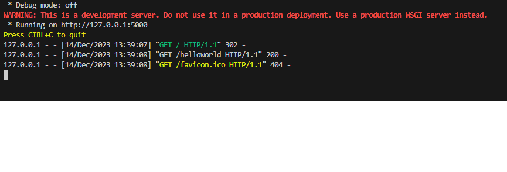
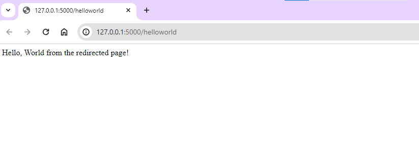
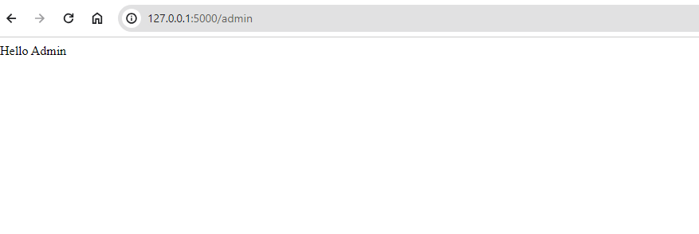

# Flask Framework - Redirecting to URL in Flask

Flask's Redirecting to Different Web Pages

When you want to send someone to a specific website link using Flask, you use something called a "redirect." It helps to show the browser where to go next.

In simple words, when you go to a website, your browser talks to the server. The server then sends back a three-number message called an HTTP status code.

Here's how you make a redirect in Flask:

```python
flask.redirect(where_to_go, code=301)
```

The different  types of HTTP codes are:

| Code | Status             |
|------|--------------------|
| 300  | Multiple_choices   |
| 301  | Moved_permanently  |
| 302  | Found              |
| 303  | See_other          |
| 304  | Not_modified       |
| 305  | Use_proxy          |
| 306  | Reserved           |
| 307  | Temporary_redirect |


## How to Redirect to a Different Page in Flask

Let's say we make a little app using Flask (which we call `app.py`). It's got two special paths: one is just the base path `/` and the other is `/helloworld`.

When someone goes to the main URL `/` (you know, the root), it's gonna send them straight over to `/helloworld`.

Here's the code:

```python
from flask import Flask, redirect

app = Flask(__name__)

@app.route("/")
def home():
    return redirect("/helloworld")

@app.route("/helloworld")
def hello_world():
    return "<p>Hello, World from the redirected page!</p>"

if __name__ == '__main__':
    app.run(debug=True)
```

**Output:**

We hit the base URL in the browser as shown below. As soon we hit the URL flask application returns the redirect function and redirects to the given URL.

```bash
set FLASK_APP=app.py
flask run
```





## Using `url_for()` in Flask

There's this cool thing in Flask called `url_for()` that helps with directing to different places.

Here's how it works: when you want to send someone to a particular place on your website, you use `url_for()`. You give it the name of the function you want to go to, and if that function needs some info (like a name), you can pass it in the URL.

Let's check out this example code:

```python
from flask import Flask, redirect, url_for

app = Flask(__name__)

@app.route('/admin')
def hello_admin():
    return 'Hello Admin'

@app.route('/guest/<guest>')
def hello_guest(guest):
    return 'Hello %s as Guest' % guest

@app.route('/user/<name>')
def hello_user(name):
    if name == 'admin':
        return redirect(url_for('hello_admin'))
    else:
        return redirect(url_for('hello_guest', guest=name))

if __name__ == '__main__':
    app.run(debug=True)
```

**Output**

