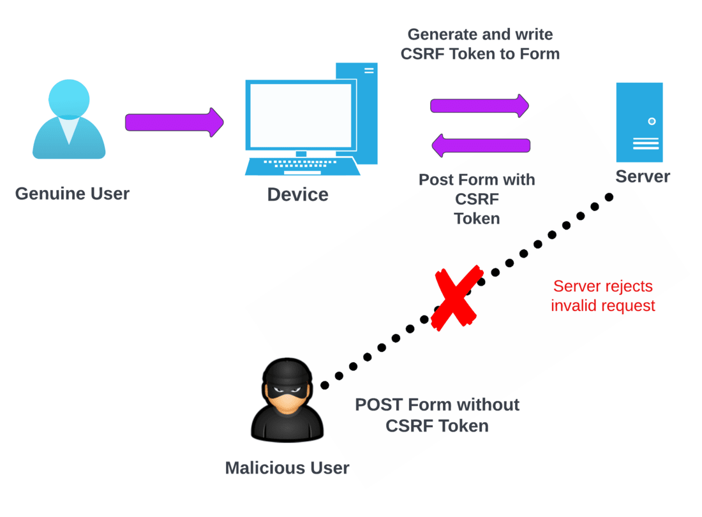
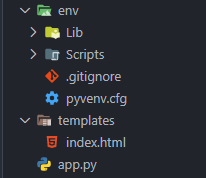

# Flask Framework - CSRF Protection in Flask

Let's explore how you can protect your data using CSRF (Cross-Site Request Forgery) protection by doing a mini-project in Flask. We'll create a webpage with two forms in Python, one of which has protection. Making forms like these helps us understand the benefits of using CSRF protection for our application.

**What's CSRF?**

Cross-Site Request Forgery (CSRF) is a serious risk that happens when a website doesn't handle requests properly. If an application sends non-unique requests, an attacker can craft a request and send it to a user. If the user interacts with this request and the requests aren't managed well, an attacker might gain access to the user's information and perform actions on their behalf.


**How to Stop CSRF Attacks**

Preventing CSRF attacks is quite manageable. One of the easiest ways is by using CSRF tokens. These tokens are unique values created by the server for each request and sent to the user. Because these values are unique and keep changing, it's almost impossible for an attacker to guess or create the URLs/requests needed to carry out an attack.




### Example of CSRF Protection in Flask

**Step 1:** Create a Virtual environment for our application and install the following packages.

**Step 2:** Installing Packages.

```bash
pip install flask, flask-wtf
```

**Step 3:** You should have to create a folder structure like this. 



**Step 4:** app.py
In Flask, there are mainly two ways to make a form: one is using FlaskForm, and the other is by creating forms manually. FlaskForm helps handle requests that already come with CSRF Protection. CSRF needs a secret key, and by default, it uses the Secret Key of the Flask app. But if you want to set up a different token, you can use WTF_CSRF_SECRET_KEY instead of the Flask app's secret key.

When you use FlaskForm, you'll need to include the CSRF field when rendering the forms. If you want to turn off CSRF Protection for all views as a default setting, you can set **WTF_CSRF_CHECK_DEFAULT** to False in the app.py file.

```python
from flask import Flask, render_template, request 
from flask_wtf import CSRFProtect 

app = Flask(__name__) 
app.secret_key = b'_53oi3uriq9pifpff;apl'
csrf = CSRFProtect(app) 


@app.route("/protected_form", methods=['GET', 'POST']) 
def protected_form(): 
	if request.method == 'POST': 
		name = request.form['Name'] 
		return (' Hello ' + name + '!!!') 
	return render_template('index.html') 

@app.route("/unprotected_form", methods=['GET', 'POST']) 
def unprotected_form(): 
	if request.method == 'POST': 
		name = request.form['Name'] 
		return (' Hello ' + name + '!!!') 
	return render_template('index.html') 

if __name__ == '__main__': 
	app.run(debug=True)
```


**Step 5:** templates/index.html 

A simple HTML page is set up for the app to show the unprotected and protected submission of the form. 

```html
<html> 
<head></head> 
<body> 
<form action="{{ url_for('protected_form') }}" method="POST"> 
	<label for="Name">Your Name Please ? </label> 
	<input type="text" name="Name"> 
	<input type="hidden" name="csrf_token" value = "{{ csrf_token() }}" /> 
	<button type="submit">Submit</button> 
</form> 


<form action="{{ url_for('unprotected_form') }}" method="POST"> 
	<label for="Name">Your Name Please ? </label> 
	<input type="text" name="Name"> 
	<button type="submit">Submit</button> 
</form> 

</body> 
</html>
```


**Step 5:** Now run it to see the webpage and perform the practice.

```python app.py```

**Output:**

Visit `127.0.0.1:5000/protected_form` and try submitting both forms and one by one you should get the following outputs. While submitting the first form we applied the token inside the form so that it checks the token if it presents it serves the request else it generates an error.


