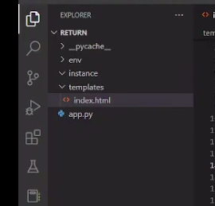
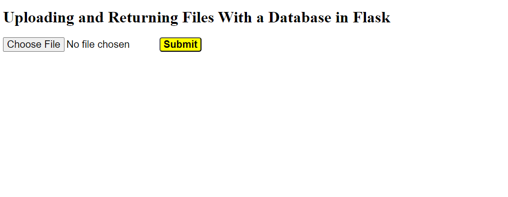
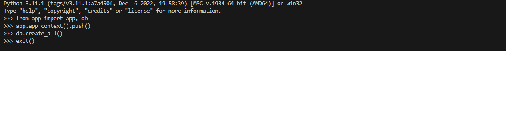
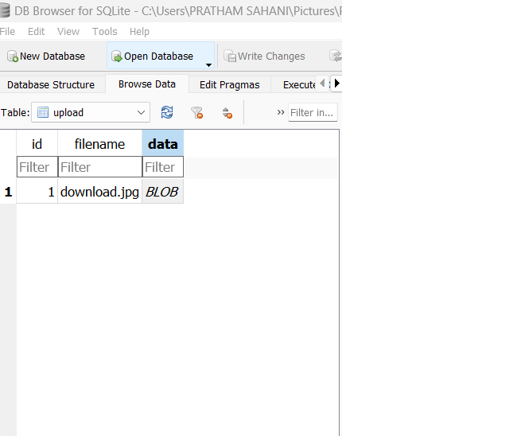

# Flask Framework - Uploading and Downloading Files 

This article will go over how to upload and download files using a Flask database using Python. Basically, we have a section for uploading files where we can upload files that will automatically save in our database. When we upload a file and submit it, a message stating that your file has been uploaded and displaying the file name on the screen appears. When we view our Flask SQLite database, we can see that our file has been automatically saved in the database. We can also download our files by using the /download /id number using the link. Consequently, we shall comprehend each phase of this method in this post.

### Uploading and Downloading Files in Flask
For our upload and return files with the database in a Flask, first, we create a templates folder for making choose file and submit button in HTML file form so let’s get started. To upload and download files with the database in Flask, first we need to download SQLite DB browser to save our data in SQLite.

### File structure




### Templates File
In the templates file, we will create only one HTML file which will operate our all frontend part code.

**index.html**
In the index.html file, we make the first heading using h1 for showing exactly what we are doing and after that, we write one form in which we declare the method POST action by using URL ‘/’ and after that, we initialize data type by using Enctype and we take the multipart/form-data in this so our all file will safely save in database and after that, we write code for simple input button and also submit button for showing all these functionalities clearly we are using some CSS in style tag for making our frontend part beautiful

```html
<!DOCTYPE html>
<html lang="en">
<head>
	<meta charset="UTF-8">
	<meta http-equiv="X-UA-Compatible" content="IE=edge">
	<meta name="viewport" content="width=device-width, initial-scale=1.0">
	<title>File Upload Example</title>
	<style>
	.ok{
		
		font-size: 20px;
	}
	.op{
		font-size: 20px;
		margin-left: -70px;
		font-weight: bold;
		background-color: yellow;
		border-radius: 5px;
		cursor: pointer;
	}
		
	
	</style>
</head>
<body>
	<div class="center">
		<h1> Uploading and Returning Files With a Database in Flask </h1>
		<form method="POST" action="/" enctype="multipart/form-data">
			<input class="ok" type="file" name="file">
			<button class="op">Submit</button>
		</form>
	</div>
	
</body>
</html>
```

### Output



### app.py
After writing code for templates we create an app.py file outside of the templates folder and create app,.py in which we will write our main code of uploading and returning files with a database in a Flask in Python language.

**Step 1:** Import all libraries 

In the app.py file we will write our main part of the code through these all operations will operate easily first in app.py we need to import all important libraries which are important for doing upload and returning files with database operations first we import io BytesIO this module will convert our all pdf files binary in below you can see what type of output will show in the database when we upload any pdf in the database and we  import render_template for rendering templates and after that, we are importing send_file module which will help us to send the file to database and after that, we are importing flask_sqlalchemy for our SQL data 

```python
from io import BytesIO
from flask import Flask, render_template, request, send_file
from flask_sqlalchemy import SQLAlchemy
```


If you server have not flask_sqlalchemy than run this command in command line:

```bash
pip3 install flask-SQLAlchemy
```

**Step 2:**  Create a database 

After importing all libraries we create an SQL database for uploading and returning our file we initialize the Flask function and after that, we make a database `sqlite:///db.sqlite3` to save our uploading files and we create one DB as SQLAchemy saving database

```python
app = Flask(__name__)
app.config['SQLALCHEMY_DATABASE_URI'] = 'sqlite:///db.sqlite3'
app.config['SQLALCHEMY_TRACK_MODIFICATIONS'] = False
db = SQLAlchemy(app)
```

**Step 3:** Create a table for the database

after creating the database we need to make a table database for which we create one ID which we make the primary key after making the id we create the filename and in the filename we initialize a varchar limit of 50 and after that, we create one data which is a blob which means we can see our file by click on the blob and for making all these functionalities we write following lines of code in our app.py file 

```python
class Upload(db.Model):
	id = db.Column(db.Integer, primary_key=True)
	filename = db.Column(db.String(50))
	data = db.Column(db.LargeBinary)
```

**Step 4:** Create an index function

We create one index function in which we set the first path ‘/’ and after that, we pass the request for method functionality in method functionality we create one var upload in which we initialize the filename and read the file if we upload a pdf so it will read it in binary form after writing this we create DB session in our database and also we commit our DB session after creating and after that we return file name with flashing massage uploaded ‘ filename’ and we return our render template on index,.html file 

```python
@app.route('/', methods=['GET', 'POST'])
def index():
	if request.method == 'POST':
		file = request.files['file']
		upload = Upload(filename=file.filename, data=file.read())
		db.session.add(upload)
		db.session.commit()
		return f'Uploaded: {file.filename}'
	return render_template('index.html')
```
After writing the code we need to create db.sqlite in our system to create a database we need to run the following command in the terminal:


```bash
~~~  python
>>>  from app import app, db
>>>  app.app_context().push()
>>>  db.create_all()
>>>  exit()
```



by running the above command in the terminal we can create a database in which our file will save after uploading and submitting the database and we can see our database in the instance folder automatically created for running how to run these commands watch a video which is attached below.

Step 5: Create a download function for downloading the file.

After uploading our file we need to make a download function for download our uploading file  for download file we make one upload variable in which we add an upload query and we filter our files by id as we set every id unique so every file has a unique id and after that, we return our file by using send_file and also for download pdf file we convert it into binary to our data file by using BytesIO module and after we can download our file by using the following link 

```url
http://127.0.0.1:5000/download/id_number 
```

```python
@app.route('/download/<upload_id>')
def download(upload_id):
	upload = Upload.query.filter_by(id=upload_id).first()
	return send_file(BytesIO(upload.data), download_name=upload.filename, as_attachment=True )
```


### Complete Code

```python
# import all libraires
from io import BytesIO
from flask import Flask, render_template, request, send_file
from flask_sqlalchemy import SQLAlchemy

# Initialize flask and create sqlite database
app = Flask(__name__)
app.config['SQLALCHEMY_DATABASE_URI'] = 'sqlite:///db.sqlite3'
app.config['SQLALCHEMY_TRACK_MODIFICATIONS'] = False
db = SQLAlchemy(app)

# create datatable
class Upload(db.Model):
	id = db.Column(db.Integer, primary_key=True)
	filename = db.Column(db.String(50))
	data = db.Column(db.LargeBinary)

# Create index function for upload and return files
@app.route('/', methods=['GET', 'POST'])
def index():
	if request.method == 'POST':
		file = request.files['file']
		upload = Upload(filename=file.filename, data=file.read())
		db.session.add(upload)
		db.session.commit()
		return f'Uploaded: {file.filename}'
	return render_template('index.html')

# create download function for download files
@app.route('/download/<upload_id>')
def download(upload_id):
	upload = Upload.query.filter_by(id=upload_id).first()
	return send_file(BytesIO(upload.data), 
					download_name=upload.filename, as_attachment=True)
```


To run the above code we need to run the following command in the terminal:

```bash
flask run
```

### Output:

After running these commands in the terminal when we upload files like pdf and images so following output will show in the database when we blob SQLite database.

Image upload

When we upload images so following image type interface will display on the screen when we blob our database.




### Pdf upload

When we upload any pdf file so database converts our pdf file into the binary form so the following type of interface will show when we upload any pdf file in the database and the blob.