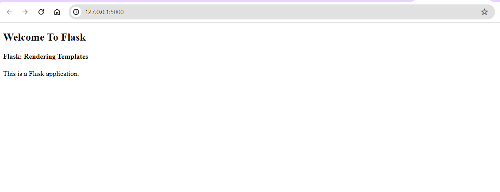

# Flask Framework - Flask Rendering Templates

Flask is like a toolbox for making websites using Python. It's all about creating web stuff in a really Python-y way. You get to use cool Python tools and tricks to build your website. With Flask, you can even make a server to show your web pages using simple HTML designs and something called Jinja2 (it's like a special way to make your pages look awesome).

Now, let's talk about making those web pages! First off, setting up Flask is pretty simple. You create this cool little space called a "virtual environment" just for your project. Then, you install some special Python stuff in that space. But before that, you gotta make sure you have Python and this thing called pip set up on your computer. If you don't have them yet, no worries! You can find out how to set them up online.

Once you've got Python and pip ready to go, it's time to dive into making your Flask applications!

### Creating the Virtual Space

Okay, so to make this special space, we use pip (that's like a magic tool for getting Python stuff) to install this thing called "virtualenv."


```bash
pip install virtualenv
```

This will install the package “virtualenv” on your machine. The pip command can be different on the version of your Python installed so please do look at the different syntax of the pip for your version [here](https://pip.pypa.io/en/stable/cli/pip/).

### Creating Virtual Environment: 

After the package has been installed we need to create a **virtual environment** in our project folder. So you can locate an empty folder where you want to create the Flask application or create an empty folder in your desired path. To create the environment we simply use the following command.

```bash 
virtualenv venv
```

Here, venv is the name of the environment, after this command has been executed, you will see a folder named “venv” in the current folder. The name “venv” can be anything(“env”) you like but it is standard to reference a virtual environment at a production level. 

### Activating Virtual Environment: 

Now after the virtual env has been set up and created, we can activate it by using the commands in **CMD\Powershel** or **Terminal:**

**Note:** You need to be in the same folder as the “venv” folder.

### For Windows:
```bash
venv\Scripts\activate
```

### For Linux/macOS:
```bash
source venv/bin/activate
```

This should activate the virtualenv with “(venv)” before the command prompt. 


As we can see we have successfully created the virtualenv in Windows Operating System, in Linux/macOS the process is quite similar. The (venv) is indicating the current instance of the terminal/CMD is in a virtual environment, anything installed in the current instance of a terminal using pip will be stored in the venv folder without affecting the entire system. 

### Installing Flask: 

After the virtual environment has been set up, we can simply install Flask with the following command:

```bash
pip install flask
```

This should install the actual Flask Python package in the virtual environment.

**Adding Flask to Environment Variables:** We need to create an app for Flask to set it as the starting point of our application. We can achieve this by creating a file called “server.py” You can call this anything you like, but keep it consistent with other Flask projects you create. Inside the server.py paste the following code:

```python
from flask import Flask

app = Flask(__name__)

if __name__ == "__main__":
	app.run()
```

This code helps make a Flask app work. It's like the starting point for the web server. First, we bring in the Flask module and set it up using our file name. Then, we use a function called run().

After this, we have to tell the computer that this file is the Flask app.

**If you're using Windows:**
```bash 
set FLASK_APP=server
```

**For Linux/macOS:**

```bash
export FLASK_APP=server
```

This makes the Flask server start from the file we made. When we begin the server, Flask knows to look for the file called 'server.py'.

**To start the server, type in this command:**
This will run the server and how smartly it detected the server.py file as our actual flask app. If you go to the URL **“http://localhost:5000”**, you would see nothing than a Not Found message this is because we have not configured our web server to serve anything just yet. You can press **CTRL + C** to stop the server


### Creating Templates in a Flask Application

Now, let's focus on what we want to do next – show the template on the screen. But first, we need to make these templates. You can use any fancy HTML you like, but I'll stick to a simple one for now.

First, make a folder named 'templates' here. This is where all our templates will live. Now, let's create a basic HTML template: This template needs some special parts called 'Jinja blocks' that we can change later if we want. We'll begin with just one block named 'body'.

**templates\index.html**

```jinja
<!DOCTYPE html>
<html>

<head>
	<title>FlaskTest</title>
</head>

<body>
	<h2>Welcome To Flask</h2>
	<h4>Flask: Rendering Templates</h4>
<!-- this section can be replaced by a child document -->



<p>This is a Flask application.</p>





</body>

</html>
```

### Making Links and Showing Templates

A route is like a map that connects a web address (URL) to a piece of code on the web server. In Flask, we use something called '@app.route' to tell the server which function should work with which URL.

**Let's create a basic route:** Here, we're connecting the main URL, '/', to a function named 'index'. You can name it something else, but 'index' makes sense for now. This function just shows something by using 'render_template'. 'render_template' automatically looks in the 'templates' folder, so we only need to mention the template's name, not the whole path. The 'index' function shows a template called index.html, and that's what we see in the browser.

Next, we want to connect a specific web address with a particular template. So, when someone visits a certain web address, a specific page should appear. To do this, we'll need to make some changes in 'server.py' as follows:

```python
from flask import Flask, render_template

app = Flask(__name__)


@app.route("/")
def index():
	return render_template("index.html")

if __name__ == "__main__":
	app.run()
```

**Output:**

We have imported the render_template function from the Flask module and added a route.



### Templating With Jinja2 in Flask

Now, we’ll create a new route for demonstrating the usage of the Jinja template. We need to add the route, so just add one more chunk of the code to the “server.py file”

```python
@app.route("/<name>")
def welcome(name):
	return render_template("welcome.html", name=name)
```

Okay, this might seem simple. We're making a route `/<name>` that connects to a function called 'welcome'. When someone types something after the `/`, like their name, it goes into the 'welcome' function as a parameter. Then, we use `'render_template'` to show a page where we can use that name. We'll even be able to do stuff with that name before showing it.

Now, let's make another template named `'welcome.html'` in the 'templates' folder. This file needs to have this code inside:


```jinja
<!DOCTYPE html>
<html>

<head>
	<title>FlaskTest</title>
</head>

<body>
	<h2>Welcome To Flask</h2>
	<h3>Welcome, {{name}}</h3>
</body>

</html>
```


### Flask – Jinja Template Inheritance Example
Now, we need a way to actually inherit some templates instead of reusing them, we can do that by creating the blocks in Jinja. They allow us to create a template block and we can use them in other templates with the name given to the block. 

So, let us re-use our “index.html” and create a block in there. T do that we use ` (where name = ‘body’)` to start the block, this will take everything above it and store it in a virtual block of template, to end the block you simply use `` this will copy everything below it. 

**templates/index.html**

```jinja
<!DOCTYPE html>
<html>
<head>
<title>FlaskTest</title>
</head>
<body>
<h2>Welcome To Flask</h2>
<h4>Flask: Rendering Templates</h4>
<a href="{{ url_for('home') }}">Home</a>
<a href="{{ url_for('index') }}">Index</a>



<p>This is a Flask application.</p>



</body>
</html>
```

Here, we're not including the `<p>` tags because everything between `` and `` is copied. We're also using something called absolute URLs. They're flexible and easy to get. We put them in `{{ }}` as part of Jinja2. The `url_for` function sorts out the whole URL for us. We just need to give it the function's name as a string.

Next, let's make another template to reuse this `body` block. We'll call it `home.html` and put this inside it:

**templates/home.html**

```jinja




<p> This is a home page</p>


```


This looks like a two-liner but will also extend (not include) the `index.html`. This is by using the `` tags, they parse the block into the mentioned template. After this, we can add the things we want. If you use the include tag it will not put the replacement paragraph in the correct place on the index.html page. It will create an invalid HTML file, but since the browser is very forgiving you will not notice unless you look at the source generated. The body text must be properly nested.

Finally, the piece left here is the route to home.html, so let’s create that as well. Let’s add another route to the `server.py file`

```python
@app.route("/home")
def home():
	return render_template("home.html")
```

So, this is a route bound to the `/home` URL with the home function that renders the template `home.html` that we created just right now.


As we can see the URL generated is dynamic, otherwise, we would have to hardcode both the template page paths. And also the block is working and inheriting the template as provided in the base templates. Open the page source in the browser to check it is properly formed HTML.


**Inducing Logic in Templates:** We can use for loops if conditions in templates. this is such a great feature to leverage on. We can create some great dynamic templates without much of a hassle. Let us create a list in Python and try to render that on an HTML template. 

**Using for loops in templates:** For that, we will create another route, this time at `/about`, this route will bind to the function about that renders the template `about.html` but we will add some more things before returning from the function. We will create a list of some dummy strings and then parse them to the render_template function.


```python
@app.route("/about")
def about():
	sites = ['twitter', 'facebook', 'instagram', 'whatsapp']
	return render_template("about.html", sites=sites)
```


We made a route at `/about` connected to the `about` function. In that function, we start by making a list called `Sites` with some pretend words. When we return, we send this list to the `render_template` function as `sites`. You can name it anything, just make sure to use the same name in the templates.

Now, to make the templates, let's create one named `about.html` with this inside:


**templates/about.html**

```jinja


<ul>
	
	<li>{{ social }}</li>
	
</ul>

```

We can use for loops in templates enclosed in `` we can call them in a regular Pythonic way. The sites are the variable(list) that we parsed in the route function. We can again use the iterator as a variable enclosed in `{{ }}`. This is like joining the puzzle pieces, the values of variables are accessed with `{{ }}`, and any other structures or blocks are enclosed in ``. 

Now to make it more accessible you can add its URL to the index.html like so:

```jinja
<!DOCTYPE html>
<html>

<head>
	<title>Flask Learning</title>
</head>

<body>
	<h2>Welcome To Flask</h2>
	<h4>Flask: Rendering Templates</h4>
	<a href="{{ url_for('home') }}">Home</a>
	<a href="{{ url_for('index') }}">Index</a>
	<a href="{{ url_for('about') }}">About</a>
	
	
	
<p>This is a Flask application.</p>


	
</body>

</html>
```

**Output:**


As we can see it has dynamically created all the lists in the template. This can be used for fetching the data from the database if the app is production ready. Also, it can be used to create certain repetitive tasks or data which is very hard to do them manually. 


### If statement in HTML Template in Python Flask

You can do something cool in Python Flask with HTML templates called `if statements` It's like making choices in your website's design. Imagine you're creating a section for different roles on a website, like `contact/<role>` When someone visits that part, it goes to a function called 'contact' that shows a template named `contacts.html` It's neat because you can use words like `person` instead of `role` in your design – it's a small change, but it makes things clearer!

```python
@app.route("/contact/<role>")
def contact(role):
	return render_template("contact.html", person=role)
```

So, this creates the route as desired and parses the variable role as a person to the template. Now let us create the template.

**template/contact.html**

```jinja






<p> Admin Section </p>




	
<p> App Source Page for Maintainer</p>




	
<p> Hope you are enjoying our services</p>




	
<p> Hello, {{ person }}</p>




```

So, in the template, we are checking the value of the variable person which is obtained from the URL and parsed from the render_template function. The if-else syntax is similar to Python with just `` enclosed. The code is quite self-explanatory as we create if-elif and else ladder, checking for a value and creating the HTML elements as per the requirement. 

See how the template shows stuff based on the role word we put in the URL? But don't try making a clickable link for it because it won't work automatically. You've gotta type in the role yourself, it's a bit tricky.

That's the deal with using templates in Flask. We used Jinja, which is a fancy way to mix Python and make templates that change depending on what you want.