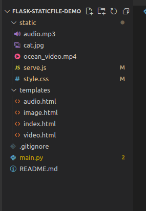
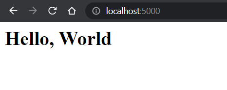
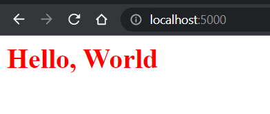
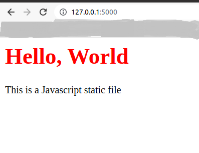
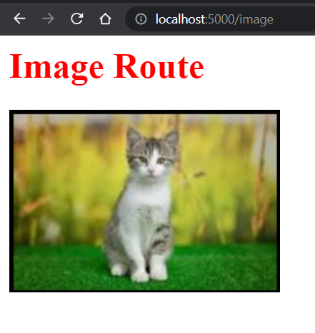
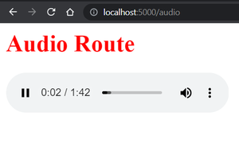
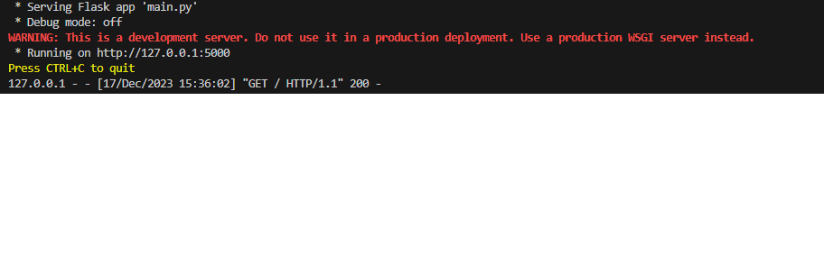

# Flask Framework - How to serve static files

Flask is a lightweight Web Server Gateway Interface or WSGI framework for web applications written in Python. It is designed to make web application development fast and easy and can scale to complex applications. This article describes and demonstrates how to serve various static files in Flask. 

### Serving Static Files in Flask
Let’s configure the virtual environment first. Although this step is optional, we always recommend using a dedicated development environment for each project. This can be achieved in a Python virtual environment.

Now that we have created our Flask app, let’s see how to serve static files using the Flask app we just created. First, static files are files served by a web server and do not change over time like CSS and Javascript files used in web applications to improve user experience. Below you will find a demonstration of various static files served by the Flask app.

### File Structure 



### HTML File
Serving HTML files using Flask is fairly simple just create a templates folder in the project root directory and create the HTML files, as **templates/index.html**. Here, we are passing text, and with the help of Jinja **{{message}}**, we are printing text that is present in the variable.

```jinja
<html> 
<head> 
<title>Flask Static Demo</title> 
</head> 
<body> 
<h1>{{message}}</h1> 
</body> 
</html> 
```

### main.py

In main.py we render the HTML file when we run it, we are using the **render_template()** function provided by Flask to render the HTML file. The final code looks like this:

```python
from flask import Flask 
from flask import render_template 

# creates a Flask application 
app = Flask(__name__) 


@app.route("/") 
def hello(): 
	message = "Hello, World"
	return render_template('index.html', 
						message=message) 

# run the application 
if __name__ == "__main__": 
	app.run(debug=True)
```


### Output:

The Flask is up and running on localhost port http://127.0.0.1:5000/




### Serve CSS file in Flask

Now serving a CSS file is the same as an HTML file but instead of **/templates** folder, we create a static folder in the root directory and add all CSS files to it, For simplicity, we have used a very simple CSS file.

```css
h1{ 
	color: red; 
	font-size: 36px; 
}
```

Now, let us link it with the HTML template file using the link tag referring to the CSS file in the static folder.

```jinja
<html> 
<head> 
	<title>Flask Static Demo</title> 
	<link rel="stylesheet" href="/static/style.css" /> 
</head> 
<body> 
	<h1>{{message}}</h1> 
</body> 
</html> 
```

### Output:




### Serve JavaScript file in Flask

To serve Javascript it is the same as a CSS file create a javascript file in the static folder.

```javascript
document.write("This is a Javascript static file") 
```

### Output:



### Serve Media files in Flask (Image, Video, Audio)

You can also use Flask to serve media files such as images, videos, audio files, text files, and PDFs. You can use the same /static folder that you used for CSS and Javascript to serve these kinds of files.

Place all media files in a static folder and associate them with their respective HTML files as shown below. Once all template files have been processed, create routes in main.py for all static files you want to render.


### Images
Create an image.html file in the templates folder and add the following code to the main.py and image.html respectively.


```python
# Images 
@app.route("/image") 
def serve_image(): 
	message = "Image Route"
	return render_template('image.html', message=message)
```

### templates/images.html

```jinja
<html> 
<head> 
	<title>Flask Static Demo</title> 
	<link rel="stylesheet" href="/static/style.css" /> 
</head> 
<body> 
	<h1>{{message}}</h1> 

	 

	<script src="/static/serve.js" charset="utf-8"></script> 
</body> 
</html> 
```

### Output:




### Video Files

To serve a video file, create a video.html file in your templates folder and add the following code to your main.py and video.html files.

```python
# video 
@app.route("/video") 
def serve_video(): 
	message = "Video Route"
	return render_template('video.html', message=message)
```

As you see the mp4 video file is been served by Flask over localhost.

```jinja
<html> 
<head> 
	<title>Flask Static Demo</title> 
	<link rel="stylesheet" href="/static/style.css" /> 
</head> 
<body> 
	<h1>{{message}}</h1> 

	<video width="320" height="240" controls> 
	<source src="/static/ocean_video.mp4" type="video/mp4" /> 
	</video> 

	<script src="/static/serve.js" charset="utf-8"></script> 
</body> 
</html> 
```

### Output:


### Audio Files

Respectively an audio file can be served by creating an **audio.html** template file and adding the following code to the **main.py**.

```python
# audio 
@app.route("/audio") 
def serve_audio(): 
	message = "Audio Route"
	return render_template('audio.html', message=message)
```


### templates/audio.html

```jinja
<html> 
<head> 
	<title>Flask Static Demo</title> 
	<link rel="stylesheet" href="/static/style.css" /> 
</head> 
<body> 
	<h1>{{message}}</h1> 

	<audio controls> 
	<source src="/static/audio.mp3" /> 
	</audio> 

	<script src="/static/serve.js" charset="utf-8"></script> 
</body> 
</html> 
```

### Output:



### Complete Flask Code
For simplicity, we have created a simple Flask application for a better understanding of how to serve static files in Flask.

```python
from flask import Flask 
from flask import render_template 

# creates a Flask application 
app = Flask(__name__) 


@app.route("/") 
def hello(): 
	message = "Hello, World"
	return render_template('index.html', message=message) 


@app.route("/video") 
def serve_video(): 
	message = "Video Route"
	return render_template('video.html', message=message) 


@app.route("/audio") 
def serve_audio(): 
	message = "Audio Route"
	return render_template('audio.html', message=message) 


@app.route("/image") 
def serve_image(): 
	message = "Image Route"
	return render_template('image.html', message=message) 


# run the application 
if __name__ == "__main__": 
	app.run(debug=True) 
```


Let’s test the Flask app by running it, to run the app just run the python **main.py** which will serve output as shown above:

### Output:




