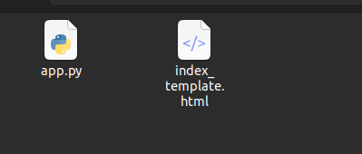
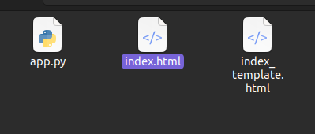
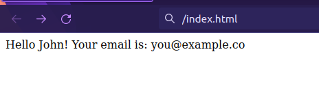
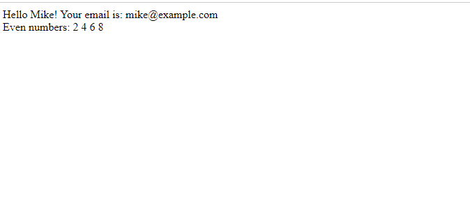
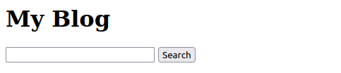
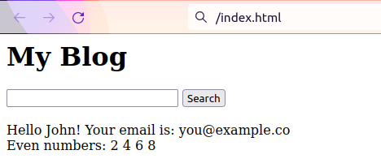

# Flask Framework - Placeholders in jinja2 Template


Websites are made using a language called HTML to create what you see and use. But what if we want to bring in stuff from other places or control things using a programming language like Python? That's where a tool like Jinja2 comes in. It helps by letting us put special codes in a template that looks a lot like Python. When we give it information, it creates the final page for us.

In this article, we'll talk about a few things:

- Template Variables: These are like placeholders for information.
- Template if Statements: They help show stuff based on certain conditions.
- Template for Loops: They're used to do things repeatedly in a template.
- Template Inheritance: This helps one template use stuff from another.
To get started, let's create a virtual space to work in. It's like making a special bubble where we can do our work without changing the whole computer. To use Jinja2 in Python, we need to add it to our tools by installing the Jinja2 library. We do this by typing `pip install Jinja2` in the terminal.

### Template Variables in Jinja2
Jinja2 is like a toolbox for Python that helps us make cool templates. It uses special spots where we can put changing information. These spots are like blanks in a story, waiting to be filled in.

How Template Variables Look in Jinja2
When we want to make a spot for something to change, in Jinja2, we use this kind of code: `{{variable_name}}`. It's like making a special sign that says, "Put something here later!"

### Example 
In an HTML file called index_template.html, write the following code.

```jinja
<!-- index_template.html -->

Hello {{pl_name}}! Your email is: {{pl_email}}
```

### app.py

We open this HTML file in Python and read its content to a variable called content. Pass the content to Template, and store it in the **template** variable. Now, we will pass the name and email to render and replace the placeholders `{{pl_name}}` and `{{pl_email}}` respectively, by using template.render; and store this in **rendered_form**.


```python
# app.py 

# import Template from jinja2 for passing the content 
from jinja2 import Template 

# variables that contain placeholder data 
name = 'John'
email = 'you@example.co'


# Create one external form_template html page and read it 
File = open('index_template.html', 'r') 
content = File.read() 
File.close() 

# Render the template and pass the variables 
template = Template(content) 
rendered_form = template.render(pl_name=name, pl_email=email) 


# save the txt file in the form.html 
output = open('index.html', 'w') 
output.write(rendered_form) 
output.close() 
```


The index.html file is created in the variable output. Write the content to this HTML file using output.write(rendered_form). Below are the two files before running the Python program.



Now, run app.py using the following command:

```bash
python app.py
```

A new file is created named index.html. Open it and see the code. The placeholder text is changed to the values that we passed.




### Conditionals and Looping in Jinja2
Jinja in-line conditionals are started with a curly brace and a `%` symbol, like `` and closed with ``. You can optionally include both `` and `` tags, and for loop, we use `` and end with ``.

### Syntax of Conditionals and Looping
For conditions, we have the following syntax in Jinja2.

| For Loop                 | If Condition           |
|--------------------------|------------------------|
| `` | `{% if i % 2 == 0 %}` |
|       ``     | ``          |


### Example

A list can also be passed using Jinja. To iterate through the list and for using conditions, similar to Python we use loop and if-condition. Let’s pass a list of numbers as well:

```python
# app.py 

# import Template from jinja2 for passing the content 
from jinja2 import Template 

# variables that contain placeholder data 
name = 'Mike'
email = 'you@example.co'
numbers = [1, 2, 3, 4, 5, 6, 7, 8, 9] 

# Create one external form_template html page and read it 
File = open('index_template.html', 'r') 
content = File.read() 
File.close() 

# Render the template and pass the variables 
template = Template(content) 
rendered_form = template.render(pl_name=name, 
								pl_email=email, numbers=numbers) 


# save the txt file in the form.html 
output = open('index.html', 'w') 
output.write(rendered_form) 
output.close() 
```


### index_template.html

Here we will iterate the number and print the even number from the list.

```html
<!-- index_template.html -->
Hello {{pl_name}}! Your email is: {{pl_email}} 
<br> 
Even numbers: 
 
	{% if i%2==0 %} 
		{{i}} 
	 
 
```

### Output:




### Template Inheritance in Jinja2

Template inheritance is a very good feature of Jinja templating. All that is needed is to add a `` tag. The home page `` inherits everything from the base template.

### Syntax of Jinja extend block

For Inherit the base page, we have the following syntax in Jinja2.


```jinja

<Code>
 
```

```jinja


   <Code>

```


### Example

Here, we want to use the same HTML content across pages like a Website name or a search bar without repeating the HTML code. For this Jinja2 has a feature called template inheritance. Suppose we need this heading and search bar on every page without repeating the code:



**base.html:** This is the code of the website name and search bar.

```jinja
<!-- base.html -->

<h1>My Blog</h1> 
<input type="search"> 
<button>Search</button> 

<!-- Child page code goes between this -->
 

<!-- You can continue base.html code after this if you want -->
<br><br>
```

Let’s include this in our index_template.html. In the child template or the page, you want to include the website name and search bar.


```jinja
<!-- index_template.html -->

<!-- include base.html -->
 

<!-- Write any code only in this block -->
 

Hello {{pl_name}}! Your email is: {{pl_email}} 
<br> 
Even numbers: 
 
	{% if i%2==0 %} 
		{{i}} 
	 
 
	
<!-- end the block -->

```


### Output:



