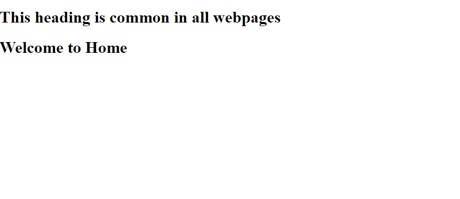

# Flask Framework - Template Inheritance


Read this text. Change, update and write better in English this content which write as your 13-year-old can understand:
Template inheritance is a very good feature of Jinja templating . Jinja is a web template engine for the Python programming language . We have seen that webpages of a website contains same footer , navigation bar etc.  So instead of making same footer and navigation bar in all webpages separately , we make use of template inheritance , which allows us to create the part which is same in all webpages (eg. footer,navigation bar) only once and we also don’t need to write the html , head , title tag again and again . Lets define the common structure of web pages in base.html file. First of all we will render  template using flask from main.py file .

**Step 1 –** Create a flask app to render the main template 

```python
from flask import Flask, render_template 

# Setting up the application 
app = Flask(__name__) 

# making route 

@app.route('/') 
def home(): 
	return render_template('home.html') 


# running application 
if __name__ == '__main__': 
	app.run(debug=True) 
```

**Step 2 –** Create HTML Files

Now we will set up our base.html file in which we have one heading which will be common in all webpages. 

**Syntax :** 

```jinja


```

The code above and below these lines will be the same for every web pages and the code between them will be for a specific web page. 


```jinja
<!DOCTYPE html> 
<html lang="en"> 
<head> 
	<title>Template Inheritance</title> 
</head> 
<body> 
	<h1> This heading is common in all webpages </h1> 
	 
	 

</body> 
</html>
```

Now we will set up our home.html file in which we will inherit template from “base.html” file and will write some code for 

home page also . 

**Syntax :**
```jinja

    
        write code here for home page only 
    
```


Run your app.py file . 

Output – 

Below is the output.





This article is just a basic example. We can also put in things like a navigation bar, footer, and more into the base.html file, then use them in other files like home.html and lots of others too!